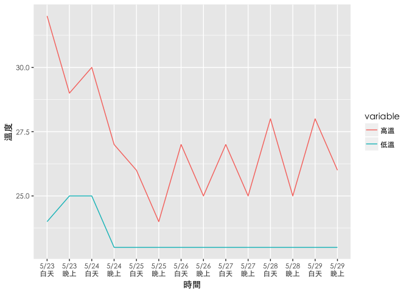

# 一週天氣預報
我是小弟  
2017/5/23  

##  在地天氣報馬仔

白天多雲、午後山區易有短暫陣雨，晚起本市因鋒面接近而易有短暫陣雨。

今(22)日天氣穩定，以多雲為主，僅部分山區午後在熱力作用下有短暫陣雨；溫度方面，臺北站測得的高溫為30.4度，低溫為24.1度。

明(22)日白天仍以多雲、午後山區易有短暫陣雨的天氣為主；不過，晚起隨著鋒面接近，本市全區都將轉為易有短暫陣雨的天氣；在溫度方面，預測白天高溫約32度，早晚低溫約24度；由於中午左右稍嫌悶熱，戶外活動請注意補充水分。

-----

### 台北市１週預報

           5/23                 5/24                     5/25               5/26           5/27               5/28               5/29             
---------  -------------------  -----------------------  -----------------  -------------  -----------------  -----------------  -----------------
白天天氣   多雲午後短暫雷陣雨   多雲時陰短暫陣雨或雷雨   陰短暫陣雨或雷雨   多雲短暫陣雨   多雲時陰短暫陣雨   多雲時陰短暫陣雨   多雲時陰短暫陣雨 
白天溫度   32-24                30-25                    26-23              27-23          27-23              28-23              28-23            
晚上天氣   多雲短暫陣雨或雷雨   陰短暫陣雨或雷雨         多雲短暫陣雨       多雲           多雲時陰           多雲時晴           晴時多雲         
晚上溫度   29-25                27-23                    24-23              25-23          25-23              25-23              26-23            

-----

### 未來7天預報圖

<!-- -->

